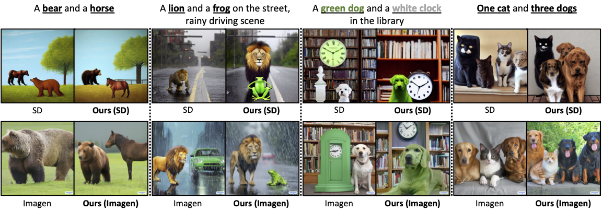
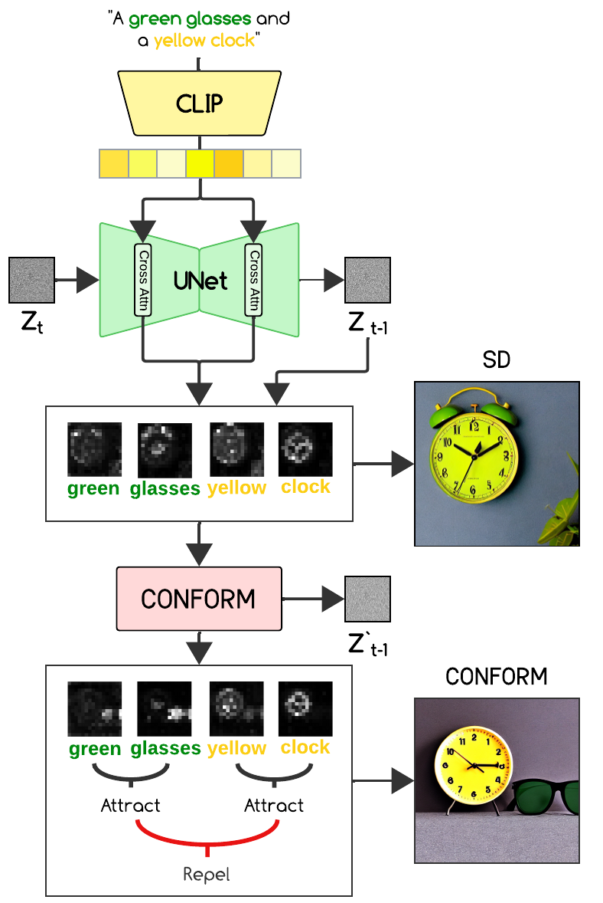
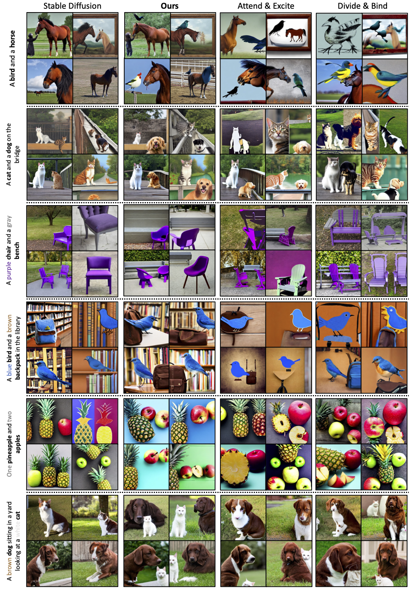

# **CONFORM: Contrast is All You Need For High-Fidelity Text-to-Image Diffusion Models [CVPR 2024]**

[](https://conform-diffusion.github.io)[](https://arxiv.org/abs/2312.06059)


><p align="center">
>[Tuna Han Salih Meral](https://tunahansalih.github.io/), [Enis Simsar](https://enis.dev/), [Federico Tombari](https://federicotombari.github.io/), [Pinar Yanardag](https://pinguar.org/)
></p>
>
> Images produced by text-to-image diffusion models might not always faithfully represent the semantic intent of the provided text prompt where the model might overlook or entirely fail to produce certain objects. While recent studies propose various solutions, they often require customly tailored functions for each of these problems, leading to sub-optimal results, especially for complex prompts. Our work introduces a novel perspective by tackling this challenge in a contrastive context. Our approach intuitively promotes the segregation of objects in attention maps, while also maintaining that pairs of related attributes are kept close to each other. We conducted extensive experiments across a wide variety of scenarios, each involving unique combinations of objects, attributes, and scenes. These experiments effectively showcase the versatility, efficiency, and flexibility of our method in working with both latent and pixel-based diffusion models, including Stable Diffusion and Imagen. Moreover, we publicly share our source code to facilitate further research. 


<p align="center">
      
    <br>
    Our training-free method combines a contrastive objective with test-time optimization, significantly improving how models such as Imagen and Stable Diffusion generate images with text prompts consisting of multiple concepts or subjects such as "a bear and a horse" 
</p>

## Description
Official implementation for our paper, CONFORM.

<p align="center">
      
<br>
An overview of CONFORM. Given a prompt (e.g., ‘A green glasses and a yellow clock’), we extract the subject tokens green, glasses, yellow, and clock and their corresponding attention maps (A<sup>green</sup>,A<sup>glasses</sup>, A<sup>yellow</sup>, A<sup>clock</sup>) from timesteps <i>t</i> and <i>t + 1</i>. We employ our contrastive objective at each time step to repel negative pairs and attract positive pairs.
</p>

## Setup

### Environment
To set up their environment, please run:
```
conda env create -f environment.yaml
conda activate conform
```

### Hugging Face Diffusers Library
Our code relies also on Hugging Face's [diffusers](https://github.com/huggingface/diffusers) library for downloading the Stable Diffusion v1.5 model. 


## Usage

<p align="center">
      
<br>
Example generations by Stable Diffusion, CONFORM, Attend & Excite, and Divide & Bind. 
</p>

To generate an image, you can use the jupyter notebook `notebook.ipynb`.

## Citation

If you find our work useful, please consider citing our paper:

```
@misc{meral2023conform,
    title={CONFORM: Contrast is All You Need For High-Fidelity Text-to-Image Diffusion Models},
    author={Tuna Han Salih Meral and Enis Simsar and Federico Tombari and Pinar Yanardag},
    year={2023},
    eprint={2312.06059},
    archivePrefix={arXiv},
    primaryClass={cs.CV}
}
```